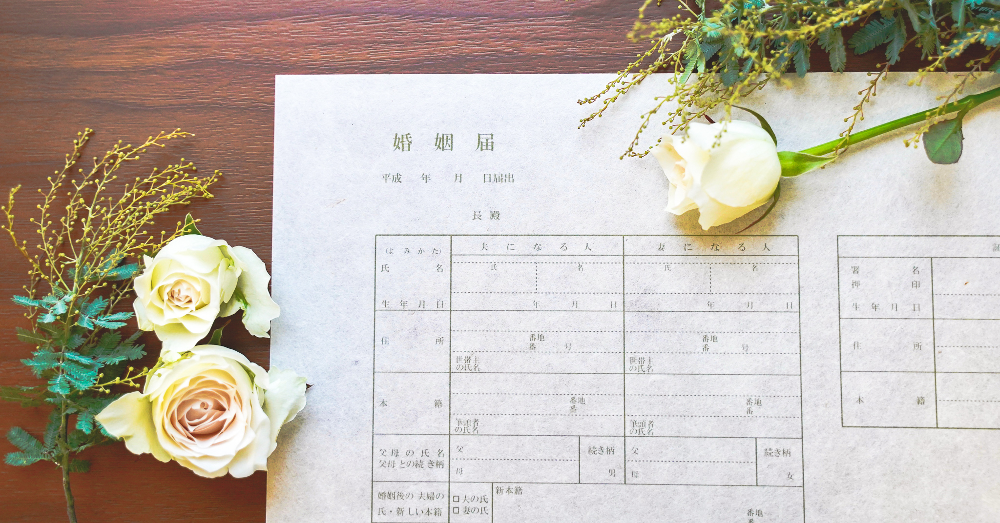
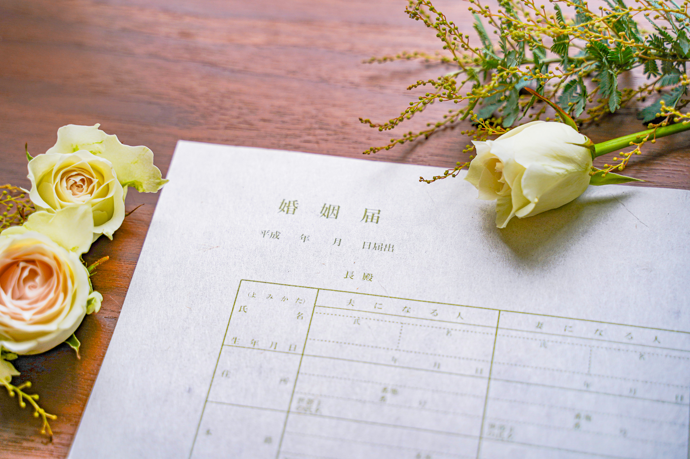

+++
draft = false
image = "img/portfolio/mc.jpg"
showonlyimage = true
date = "2020-08-13T20:23:59+05:30"
title = "「夫婦になる瞬間」を永遠に。千年残る和紙婚姻届『千年婚姻届』"
weight = 1
+++
<!--more-->

*"一生手元に残したくなるくらい綺麗な、しかもかっこ良くて渋い、特別な婚姻届を作りたい"*

1300年の歴史を持つ島根の伝統的な手漉き和紙と、出雲大社の縁結びで有名な"ご縁の国"の魅力を最大限に活かした "Made in 島根" の和紙婚姻届を作りました。


Filmed by [PZ福岡](https://www.youtube.com/channel/UClFq2OpuYvbmWIIxy5fTJGA)

この和紙婚姻届の特徴をまとめるとこんな感じです。

■ 素材の紙は、島根県浜田市の和紙職人によって制作される『石州和紙』を使用しています。この和紙を作る職人の技術はユネスコ無形文化遺産にも登録され、作られる和紙は1000年残った実績があるほど耐久性が高い和紙です。

■ 和紙婚姻届の上にカーボン紙を重ね、さらにその上に役所提出用の婚姻届を重ねて書くことで、書いた文字を和紙婚姻届に複写させます。一番上に重ねた提出用の婚姻届は通常通り役所に提出し、複写された和紙婚姻届は記念に手元に残すことができます。

千年保ち、複写式で手元に残せるこの"一生残る和紙婚姻届"を『千年婚姻届』と名づけました。

「千年婚姻届」のブランドロゴ。
ご縁・和紙技術の継承・未来に続く思いなど、さまざまな意味を込め作成しました。


Filmed by https://mikayamashita.com/

#### Related Page
- [夫婦になる瞬間を永遠に残す、千年残る手漉き和紙婚姻届を作りました - note](https://note.com/ysdyt/n/nbacba1e130f1)
- [意味を形にし、命を吹き込む - note](https://note.com/ysdyt/n/ne9a744d9b91b?magazine_key=m7d404b2cf3b5)
- [千年残る和紙婚姻届ができるまで- note magazine](https://note.com/ysdyt/m/m7d404b2cf3b5)
