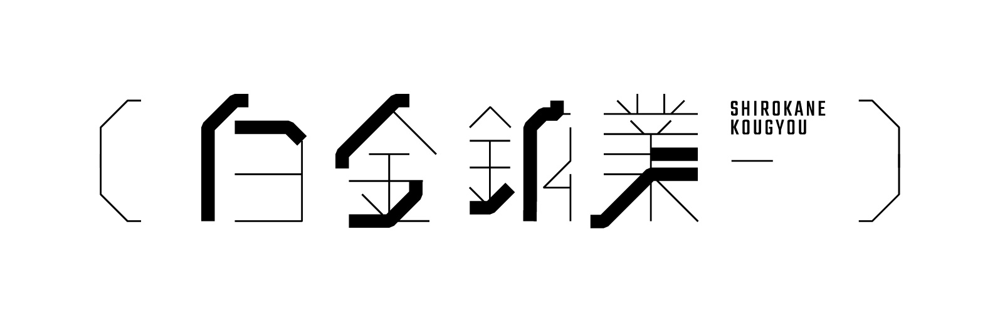

+++
draft = false
image = "img/portfolio/shirokane_kougyou_logotype.jpg"
showonlyimage = true
date = "2017-06-21T20:23:59+05:30"
title = "Podcast「白金鉱業.FM」"
weight = 5
+++

<!--more-->

2019年9月から会社の同僚たちと始めた、AI・データサイエンスに関する話をするPodcast「白金鉱業.FM」です。  
https://shirokane-kougyou.fm/

ApplePodcast/Spotifyで配信中。番組のtwitterハッシュタグは[#白金鉱業fm](https://twitter.com/search?q=%23%E7%99%BD%E9%87%91%E9%89%B1%E6%A5%ADfm&src=hashtag_click&f=live)です。匿名の質問/感想などは[マシュマロ](http://marshmallow-qa.com/shirokane_fm)で受け付けています。  
[JAPAN PODCAST AWARDS 2020 推薦作品](https://www.japanpodcastawards.com/recommends/index.html)にも選ばれました。

#### Related Page
- [白金鉱業.FM 番組HP](https://shirokane-kougyou.github.io/)
- Twitterアカウント [@shirokane_fm](https://twitter.com/shirokane_fm)
